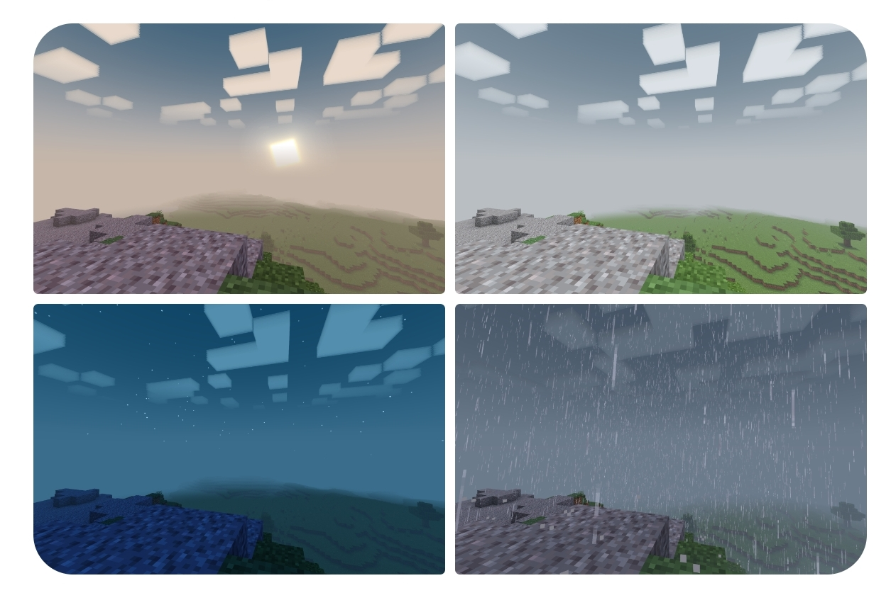

# Newb X Utitaretion

[newb-shader-mcbe](https://github.com/devendrn/newb-shader-mcbe) for MCBE 1.20. It is a vanilla shader based on the theme "lightweight and soft aesthetics".

> Note:
This is an experimental repository, breaking changes are made often.

## Screenshot

## Android
[Download](https://github.com/MKGamer345/newb-x-utitaretion/actions/runs/7361548136/artifacts/1139972732)

## IOS
[Download](https://github.com/MKGamer345/newb-x-utitaretion/actions/runs/7361548136/artifacts/1139972733)

## Windows
[Download](https://github.com/MKGamer345/newb-x-utitaretion/actions/runs/7361548136/artifacts/1139972734)

# Super Fancy Newb Shader

[newb-shader-mcbe](https://github.com/devendrn/newb-shader-mcbe) for MCBE 1.20. It is a vanilla shader based on the theme "lightweight and soft aesthetics".

> Note:
This is an experimental repository, breaking changes are made often.

## Screenshot

## Android
[Download](https://github.com/MKGamer345/Super-Fancy-Newb-shader/actions/runs/7437000191/artifacts/1152334429)

## IOS
[Download](https://github.com/MKGamer345/Super-Fancy-Newb-shader/actions/runs/7437000191/artifacts/1152334431)

## Windows
[Download](https://github.com/MKGamer345/Super-Fancy-Newb-shader/actions/runs/7437000191/artifacts/1152334432)

