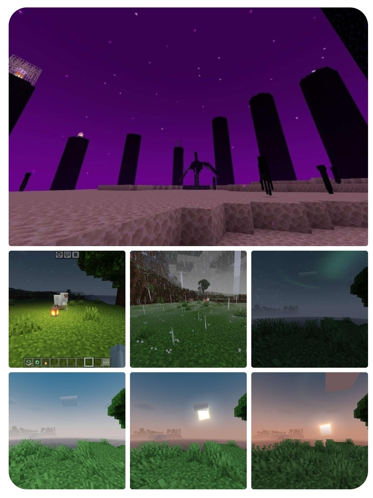

# Newb X Utitaretion

[newb-shader-mcbe](https://github.com/devendrn/newb-shader-mcbe) for MCBE 1.20. It is a vanilla shader based on the theme "lightweight and soft aesthetics".

> Note:
This is an experimental repository, breaking changes are made often.

## Screenshot



## Downloads

[download shader web](https://github.com/MKGamer345/Download-shader/blob/main/Download.md)

## Installation

#### Linux: ([minecraft-manifest](https://github.com/minecraft-linux/mcpelauncher-ui-manifest))
1. Extract material.bin files from shader mcpack / build materials manually
2. Move these files to data root `mcpelauncher/versions/1.20.x/assets/renderer/materials/`.
   (Make sure to backup all files in this folder)
3. Import resource pack and activate it in global resources.

#### Windows:
1. Use [BetterRenderDragon](https://github.com/ddf8196/BetterRenderDragon) to enable MaterialBinLoader.
2. Import resource pack and activate it in global resources.

#### Android:
1. Install [Patched Minecraft app (Only for 64-bit)](https://github.com/DominoKorean/Render-dragon-shader-list/blob/main/patchedapp.md)
2. Import resource pack and activate it in global resources.

## Building

#### Windows:
1. Setup build evironment:
```
.\setup.bat
```
2. Compile material src files:
```
.\build.bat
```

#### Linux:
1. Setup build evironment:
```
./setup.sh
```
2. Compile material source files:
```
./build.sh
```

---
**Available parameters for build script are:**
```
-p    Target platforms (android, windows, ios, mer# Newb X Utitaretion

[newb-shader-mcbe](https://github.com/devendrn/newb-shader-mcbe) for MCBE 1.20. It is a vanilla shader based on the theme "lightweight and soft aesthetics".

> Note:
This is an experimental repository, breaking changes are made often.

## Screenshot


## Downloads

[download shader web](https://github.com/MKGamer345/Download-shader/blob/main/Download.md)

## Installation

#### Linux: ([minecraft-manifest](https://github.com/minecraft-linux/mcpelauncher-ui-manifest))
1. Extract material.bin files from shader mcpack / build materials manually
2. Move these files to data root `mcpelauncher/versions/1.20.x/assets/renderer/materials/`.
   (Make sure to backup all files in this folder)
3. Import resource pack and activate it in global resources.

#### Windows:
1. Use [BetterRenderDragon](https://github.com/ddf8196/BetterRenderDragon) to enable MaterialBinLoader.
2. Import resource pack and activate it in global resources.

#### Android:
1. Install [Patched Minecraft app (Only for 64-bit)](https://github.com/DominoKorean/Render-dragon-shader-list/blob/main/patchedapp.md)
2. Import resource pack and activate it in global resources.

## Building

#### Windows:
1. Setup build evironment:
```
.\setup.bat
```
2. Compile material src files:
```
.\build.bat
```

#### Linux:
1. Setup build evironment:
```
./setup.sh
```
2. Compile material source files:
```
./build.sh
```

---
**Available parameters for build script are:**
```
-p    Target platforms (android, windows, ios, merged)
-m    Materials to compile (if unspecified, builds all material files)
-t    Number of threads to use for compilation (default is cpu cores count)
ged)
-m    Materials to compile (if unspecified, builds all material files)
-t    Number of threads to use for compilation (default is cpu cores count)

# Super Fancy Newb Shader

[newb-shader-mcbe](https://github.com/devendrn/newb-shader-mcbe) for MCBE 1.20. It is a vanilla shader based on the theme "lightweight and soft aesthetics".

> Note:
This is an experimental repository, breaking changes are made often.

## Screenshot


## Downloads

[download shader web](https://github.com/MKGamer345/Download-shader/blob/main/Download.md)

## Installation

#### Linux: ([minecraft-manifest](https://github.com/minecraft-linux/mcpelauncher-ui-manifest))
1. Extract material.bin files from shader mcpack / build materials manually
2. Move these files to data root `mcpelauncher/versions/1.20.x/assets/renderer/materials/`.
   (Make sure to backup all files in this folder)
3. Import resource pack and activate it in global resources.

#### Windows:
1. Use [BetterRenderDragon](https://github.com/ddf8196/BetterRenderDragon) to enable MaterialBinLoader.
2. Import resource pack and activate it in global resources.

#### Android:
1. Install [Patched Minecraft app (Only for 64-bit)](https://github.com/DominoKorean/Render-dragon-shader-list/blob/main/patchedapp.md)
2. Import resource pack and activate it in global resources.

## Building

#### Windows:
1. Setup build evironment:
```
.\setup.bat
```
2. Compile material src files:
```
.\build.bat
```

#### Linux:
1. Setup build evironment:
```
./setup.sh
```
2. Compile material source files:
```
./build.sh
```

---
**Available parameters for build script are:**
```
-p    Target platforms (android, windows, ios, mer# Newb X Utitaretion

[newb-shader-mcbe](https://github.com/devendrn/newb-shader-mcbe) for MCBE 1.20. It is a vanilla shader based on the theme "lightweight and soft aesthetics".

> Note:
This is an experimental repository, breaking changes are made often.

## Screenshot


## Downloads

[download shader web](https://github.com/MKGamer345/Download-Newb-X-shader/blob/main/Download.md)

## Installation

#### Linux: ([minecraft-manifest](https://github.com/minecraft-linux/mcpelauncher-ui-manifest))
1. Extract material.bin files from shader mcpack / build materials manually
2. Move these files to data root `mcpelauncher/versions/1.20.x/assets/renderer/materials/`.
   (Make sure to backup all files in this folder)
3. Import resource pack and activate it in global resources.

#### Windows:
1. Use [BetterRenderDragon](https://github.com/ddf8196/BetterRenderDragon) to enable MaterialBinLoader.
2. Import resource pack and activate it in global resources.

#### Android:
1. Install [Patched Minecraft app (Only for 64-bit)](https://github.com/DominoKorean/Render-dragon-shader-list/blob/main/patchedapp.md)
2. Import resource pack and activate it in global resources.

## Building

#### Windows:
1. Setup build evironment:
```
.\setup.bat
```
2. Compile material src files:
```
.\build.bat
```

#### Linux:
1. Setup build evironment:
```
./setup.sh
```
2. Compile material source files:
```
./build.sh
```

---
**Available parameters for build script are:**
```
-p    Target platforms (android, windows, ios, merged)
-m    Materials to compile (if unspecified, builds all material files)
-t    Number of threads to use for compilation (default is cpu cores count)
ged)
-m    Materials to compile (if unspecified, builds all material files)
-t    Number of threads to use for compilation (default is cpu cores count)
